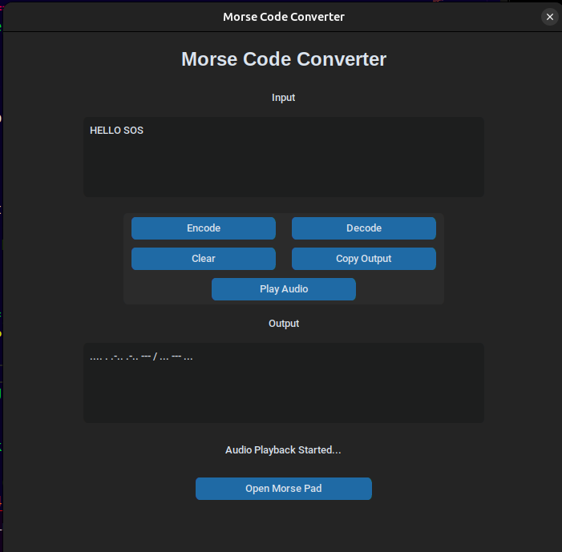

# Morse Code Converter

A desktop Morse Code Converter built with Python and CustomTkinter.

This application can:

- Encode text into Morse code
- Decode Morse code into text
- Play Morse code as audio
- Generate Morse code manually using an interactive Morse Pad
- Live decode Morse code entered through the Morse Pad
- Copy output directly to the clipboard

---

## Features

### Text → Morse Conversion

Convert plain text into Morse code instantly.

### Morse → Text Conversion

Decode Morse code back into readable text.

### Interactive Morse Pad

Create Morse code manually using:

- Dot (.)
- Dash (-)
- Letter Space
- Word Space

### Live Decoding

The Morse Pad automatically decodes Morse code while you type.

### Audio Playback

Play Morse code as audible beeps with proper Morse timing.

### Clipboard Support

Copy generated Morse code with a single click.

---

## Screenshots

### Main Window


### Text Encoding


### Text Decoding and Clipboard Support


### Morse Pad


### Live Decoding in Morse Pad


### Audio Playback



---

## Technologies Used

- Python
- CustomTkinter
- NumPy
- Pygame

---

## Installation

Clone the repository:

```bash
git clone https://github.com/shr3sth/morse_code_app
cd morse_code_app
```

Create a virtual environment:

```bash
python3 -m venv venv
source venv/bin/activate
```

Install dependencies:

```bash
pip install -r requirements.txt
```
## System Dependencies

This application uses Tkinter for its GUI.
On Linux, Tkinter may need to be installed separately
using your distribution's package manager.

### Ubuntu / Debian / Linux Mint
sudo apt install python3-tk

### Arch Linux / CatchyOS / EndeavourOS
sudo pacman -S tk

### Fedora
sudo dnf install python3-tkinter

Run the application:

```bash
python src/gui.py
```

---

## Project Status

Version: 3.0

Current Features:

- Text ↔ Morse conversion
- Audio playback
- Interactive Morse Pad
- Live decoding
- Clipboard support

Future Ideas:

- Real-time Morse audio from Morse Pad
- Export Morse audio to WAV
- Hardware integration with microcontrollers and LEDs

---

## Author

Shresth
