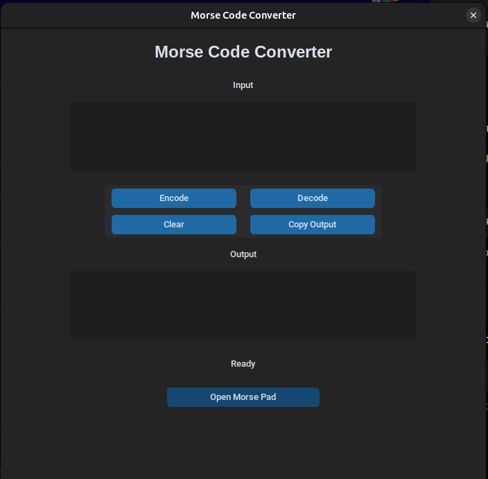
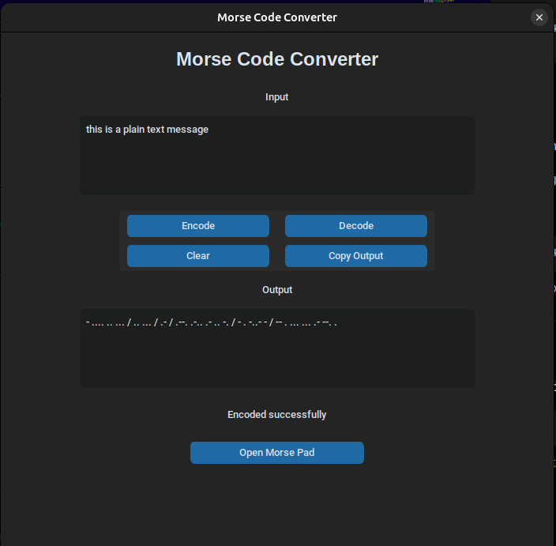
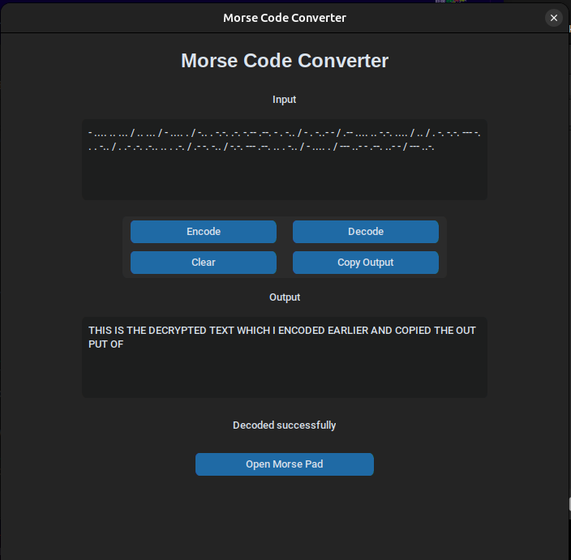
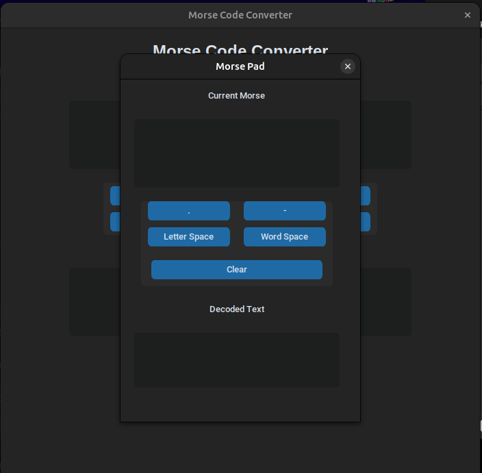
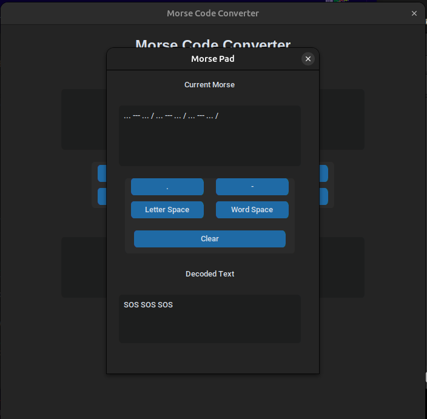

# Morse Code Converter

A beginner-friendly Python application that converts text to Morse code and Morse code back to text.

Built with Python and CustomTkinter on Linux.

## Features

- Encode text to Morse code
- Decode Morse code to text
- Clean dark-themed GUI
- Copy output to clipboard
- Clear input/output fields
- Interactive Morse Pad
- Live Morse decoding in Morse Pad

## Screenshots

### Main Window



### Text to Morse Encoding



### Morse to Text Decoding



### Morse Pad



### Live Decoding



## Installation

Clone the repository:

```bash
git clone https://github.com/shr3sth/morse_code_app
cd morse-code-app
```

Create a virtual environment:

```bash
python3 -m venv venv
source venv/bin/activate
```

Install dependencies:

## Install dependencies:

```bash
pip install -r requirements.txt
```

## Run

```bash
python src/gui.py
```

## Technologies Used

- Python
- CustomTkinter
- Git
- GitHub

## Project Status

Current Version: v2.0

Completed:

- Core Morse Engine
- GUI Converter
- Clipboard Support
- Interactive Morse Pad
- Live Decoding

Planned:

- Audio Playback (v3.0)
